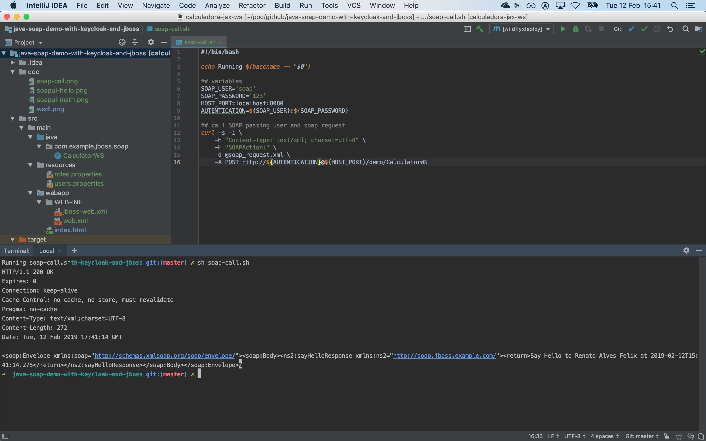
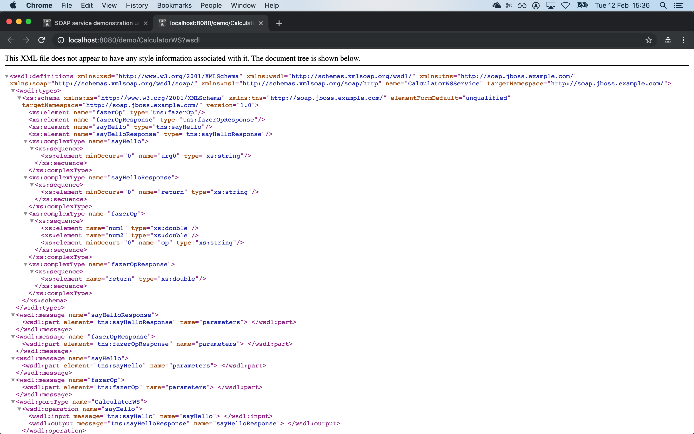
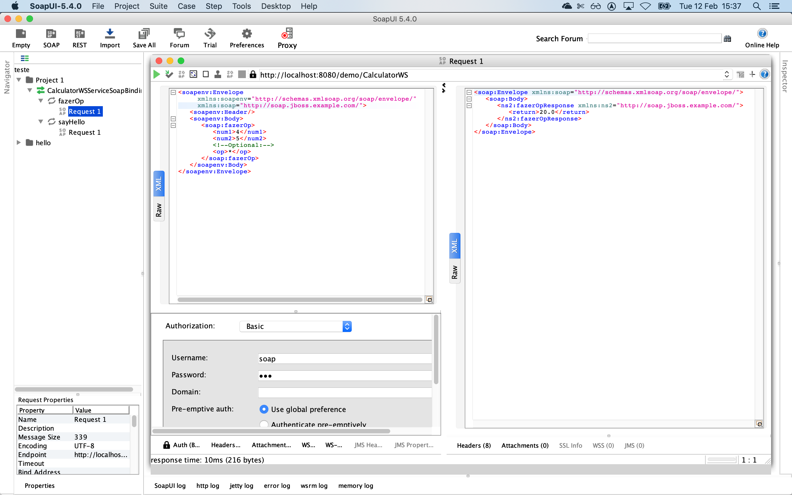
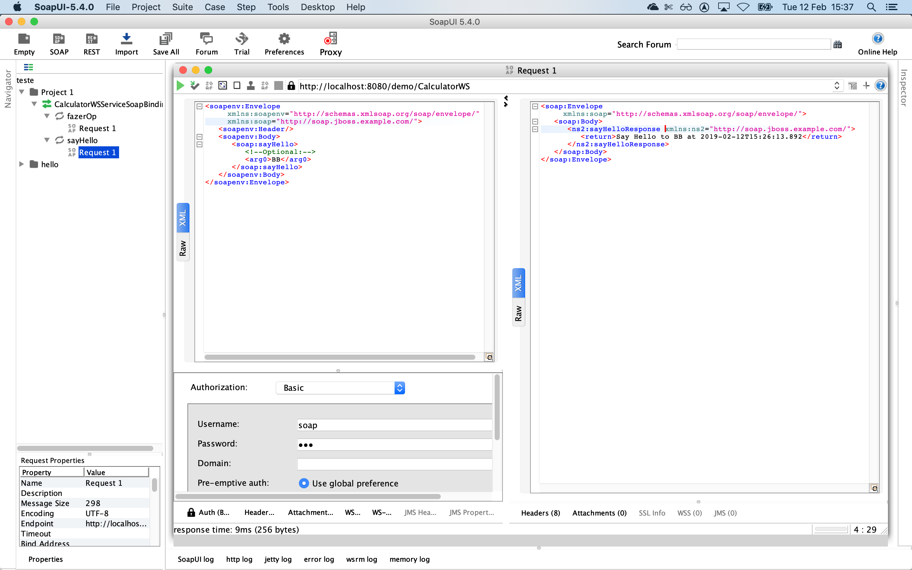

# Java SOAP Service

SOAP service demonstration using [JBOSS EAP 7.x or 6.x or Wildfly](https://access.redhat.com/articles/112673) + [Red Hat Single Sign ON 7.2 - Keycloak 3.4.3](https://access.redhat.com/articles/2342881)


# Prerequisites

1. [Java](http://www.oracle.com/technetwork/java/javase/downloads/jdk8-downloads-2133151.html) 8+
2. [Maven](https://maven.apache.org) 3+
3. JBoss EAP-7.2 running on default ports using standalone
4. Add security-domain for JAAS authentication test Basic Authentication
5. [Reference for using JBOSS EAP with maven](https://access.redhat.com/documentation/en-us/red_hat_jboss_enterprise_application_platform/7.2/html/development_guide/using_maven_with_eap)


##### Start JBOSS (with defaults) into terminal
```shell
sh ${JBOSS_HOME}/bin/standalone.sh
```

##### Command line to add security-domain, at running JBOSS (run it into another terminal)
```
sh ${JBOSS_HOME}/bin/jboss-cli.sh -c --file=${JAVA_SOAP_DEMO_HOME}/config-security-domain.cli
```

###### output
```JSON
The batch executed successfully
{
    "outcome" => "success",
    "result" => undefined
}
```

###### `${JBOSS_HOME}/standalone/configuration/standalone.xml` result 
   This will read those project files  and  
```XML
        <subsystem xmlns="urn:jboss:domain:security:2.0">
            <security-domains>
...
                <security-domain name="soap-security-domain">
                    <authentication>
                        <login-module code="UsersRoles" flag="required">
                            <module-option name="usersProperties" value="users.properties"/>
                            <module-option name="rolesProperties" value="roles.properties"/>
                            <module-option name="unauthenticatedIdentity" value="nobody"/>
                        </login-module>
                    </authentication>
                </security-domain>
            </security-domains>
        </subsystem>
```
# How to run JBOSS (run it into another terminal)

Clone

```
git clone https://github.com/jovemfelix/java-soap-demo-with-keycloak-and-jboss.git
```

Inside

```
cd java-soap-demo-with-keycloak-and-jboss
```

Run 

```
mvn clean wildfly:deploy
```


Output

```
-------------------------------------------------------
 T E S T S
-------------------------------------------------------

```


WSDL

[http://localhost:8080/demo/CalculatorWS?wsdl](http://localhost:8080/demo/CalculatorWS?wsdl)



Client

SoapUI > SOAP > Initial WSDL > [http://localhost:8080/demo/CalculatorWS?wsdl](http://localhost:8080/demo/CalculatorWS?wsdl)




# How to use it on Keycloak
```
git checkout [basic-auth-soap-with-keycloak](https://github.com/jovemfelix/java-soap-demo-with-keycloak-and-jboss/tree/basic-auth-soap-with-keycloak)
```