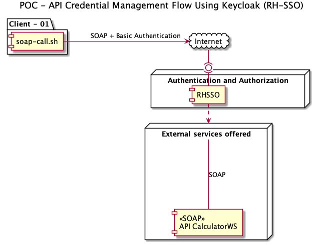
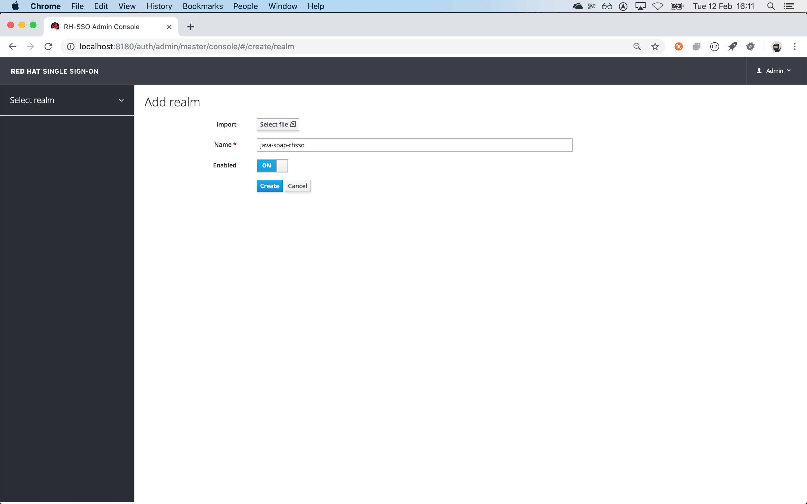
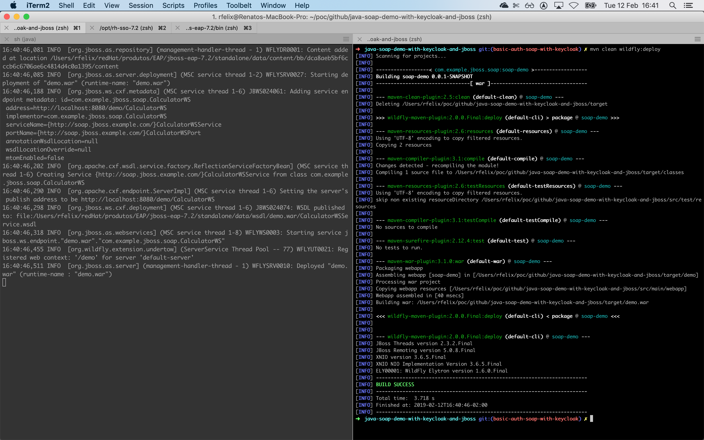

# Java SOAP Service

SOAP service demonstration using [JBOSS EAP 7.x or 6.x or Wildfly](https://access.redhat.com/articles/112673) + [Red Hat Single Sign ON 7.2 - Keycloak 3.4.3](https://access.redhat.com/articles/2342881)

# Overview


# Prerequisites

1. [README.md of master](https://github.com/jovemfelix/java-soap-demo-with-keycloak-and-jboss#master) here gonna have only the differences from a normal project
2. if nothing is said, it is the default setting 
3. Need to install at JBOSS the adpater corresponding to [right version](https://access.redhat.com/jbossnetwork/restricted/listSoftware.html?downloadType=distributions&product=core.service.rhsso&version=7.2) 
3.1. To install it follow the official documentation [https://access.redhat.com/documentation/en-us/red_hat_single_sign-on/7.2/html/securing_applications_and_services_guide/overview#what_are_client_adapters](https://access.redhat.com/documentation/en-us/red_hat_single_sign-on/7.2/html/securing_applications_and_services_guide/overview#what_are_client_adapters)
3.2 Sample of erro when you dont install the adapter


##### Start Keycloak (RH-SSO 7.2) (using port 8180 for not get conflicted with the running EAP)
```shell
sh ${RHSSO_HOME}/bin/standalone.sh -Djboss.socket.binding.port-offset=100
```

##### An RH-SSO [http://localhost:8180/auth/admin/master/console](http://localhost:8180/auth/admin/master/console) do:
1.0 Create a Realm

2.0 With a Client, create it

2.1. Add a role to the client

2.1.1. Must have the same name configured at 
2.2. Disable de Full Scope

2.3. Copy the Installation content to [keycloak.json](/src/main/webapp/WEB-INF/keycloak.json)

2.3.1. For the basic communication works you NEED to enable the property `enable-basic-auth` and REMOVE the property `confidential-port 

3.0 With a User, create it

3.1. Change the user password for ``123``, and disable Temporary

3.2. Select Role Mapping from the client created


##### Delete file that is not necessary (because we gonna use RH-SSO configurations)
```
cd java-soap-demo-with-keycloak-and-jboss
rm -rf ./src/main/webapp/WEB-INF/jboss-web.xml
rm -rf ./src/main/resources
```
 
##### Redeploy the Application with the configurations at  and  [keycloak.json](/src/main/webapp/WEB-INF/keycloak.json) 
```
cd java-soap-demo-with-keycloak-and-jboss
mvn clean wildfly:deploy
```

###### output


##### At the new browser session open [http://localhost:8080/demo/CalculatorWS?wsdl](http://localhost:8080/demo/CalculatorWS?wsdl)
You will be redirect to RH-SSO login page

You should be able to login in using the user `soap` and password `123` that was configured at RH-SSO

##### Test using shell script like before


#### Client - Adds authentication information to outgoing request


SoapUI > SOAP > Initial WSDL > [http://localhost:8080/demo/CalculatorWS?wsdl](http://localhost:8080/demo/CalculatorWS?wsdl)


